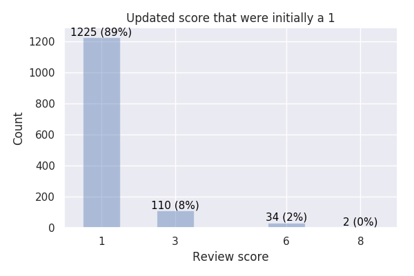
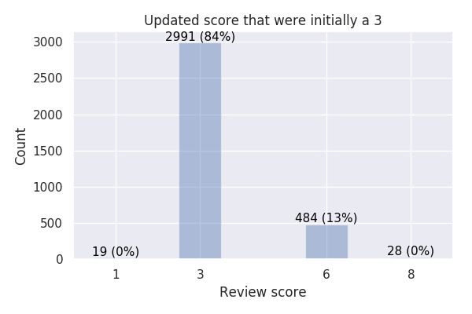
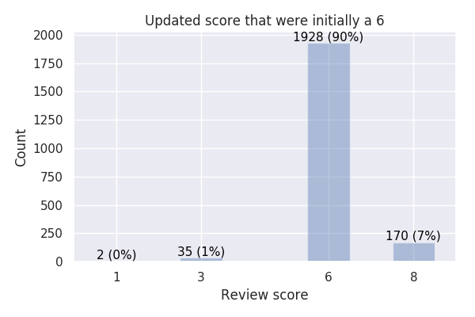
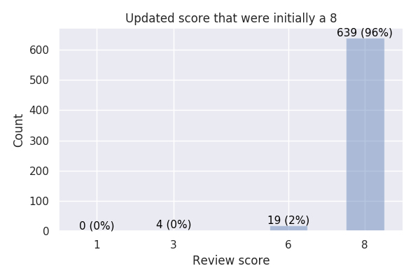
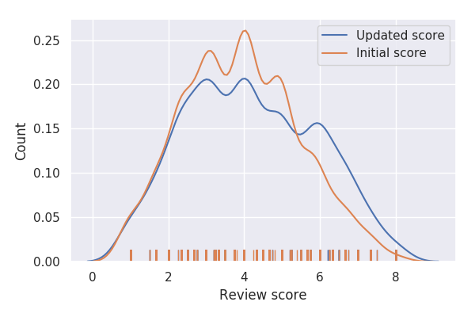

# How did the discussion period affected ICLR 2020's review scores

The ICLR reviewers were allowed to provide one of the following four scores, sometimes also called rating, for each submission:

- 1: Reject
- 3: Weak reject
- 6: Weak accept
- 8: Accept

In contrast to the peer-review process of other conferences, ICLR has a bi-directional communication channel between the authors and the reviewers, in form of a two weeks discussion period.

One may ask the question how this discussion period affected the scores of this years' reviews.

In particular, **11.79%** of all reviews changed their score during/after the discussion period.

- Average score of a submission **before** discussion: 3.91
- Average score of a submission **after** discussion: 4.18

## How does initial score correlate with updated score

## How does a change in score correlate with the experience of the reviewer

| Experience assessment | Number of reviews |  % of reviews that changed score |
| --- | --- | --- | 
| 0: *I do not know much about this area* | 1097 [14.27%] | 9.48% |
| 1: *I have read many papers in this area* |  2521 [32.78%] | 11.15% |
| 2: *I have published one or two papers in this area* |2636 [34.28%] | 12.97% |
| 3: *I have published in this field for several years*  | 1436 [18.67%] | 12.53% |
| Overall | 7690 [100%]| 11.79% |

## How does a change in score correlate with the thoroughness in paper reading

| Thoroughness assessment | Number of reviews | % of reviews that changed score |
| --- | --- | --- | 
| N/A | 175 [2.28%] | 13.71% |
| *I made a quick assessment of this paper* | 617 [8.02%] | 9.72% |
| *I read the paper at least twice and used my best judgement in assessing the paper* | 4156 [54.04%] | 10.35% |
| *I read the paper thoroughly* | 2742 [35.66%] | 14.33% |
| Overall | 7690 [100%]| 11.79% |

## Distribution of average score per submission

### Quantiles 

| Top % of submissions | Initial quantile | Updated quantile | Example |
| --- | --- | --- | --- |
80% | 2.3 | 2.3 |  |
50% | 4.0 | 4.0 |  |
40% | 4.0 | 4.7 | (3, 3, 8) |
30% | 4.8 | 5.0 | (3, 6, 6) or (1, 6, 8) |
25% | 5.0 | 5.7 | (3, 6, 8) or (1, 8, 8) |
20% | 5.0 | 6.0 |  (6, 6, 6) |
15% | 5.7 | 6.0 | |
12.5% | 5.7 | 6.3 | (3, 8, 8) |
10% | 6.0 | 6.7 | (6, 6, 8) |
5% | 6.7 | 7.0 | (6, 8, 8) |
1% | 7.3 | 8.0 | (8, 8, 8) |

### Density plot

## Reproducibly statement

The scripts in this repo that generate these review statistics are based on the code by [Bastian Rieck](https://github.com/Pseudomanifold/iclr-analysis) (many Thanks for providing user-friendly code and the initial review data). 
